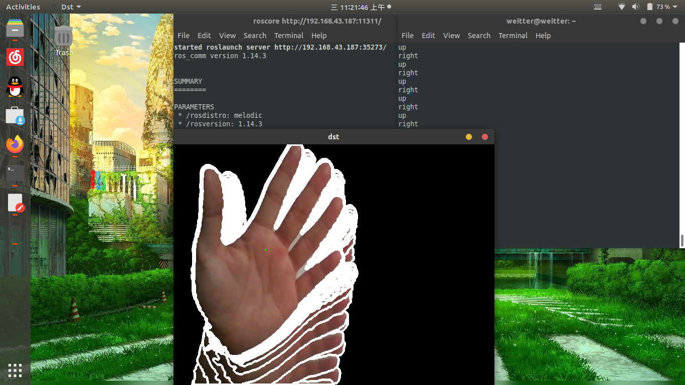

# bell

This is a gesture recognition remote control project based on c++ language, ROS platform 

Tutorials 
--------

The following guide will help you install and run the project on your local machine for development and testing. 

Installation requirements 
-------------------------

ROS `Melodic` Morenia or ROS `Kinetic` Kame system is necessary

Installation steps 
------------------
you need: 
```shell
git clone https://github.com/Weitter/bell.git
cd ~/catkin_ws && catkin_make
source ~/catkin_ws/devel/setup.bash
roscore
rosrun rosOpenCV roscamera4
```
Finally, after the installation is completed,show 

Author
------
weitter 

Thanks 
------
The project reference network
